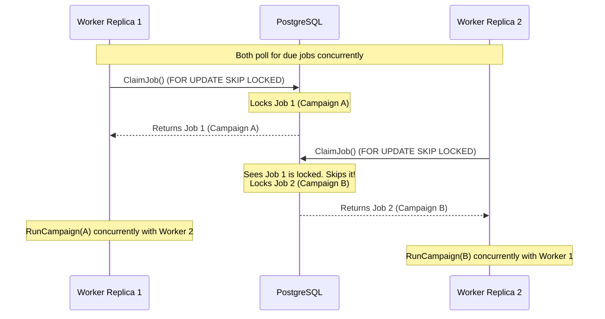

# 🔍 Reddit Lead Finder

Welcome to **Reddit Lead Finder**, an automated SaaS application that scans subreddits for high-engagement, high-intent posts matching keyword configurations to capture target audience leads seamlessly.

This repository is structured as a **Monorepo** comprising two main services:
- **Go Backend Service (`/`)**: A fast, concurrent engine built with Go, PostgreSQL, Goose, and SQLC.
- **Next.js Client Service (`/client`)**: A sleek modern dashboard built with React 19, TypeScript, Tailwind CSS, and AWS Cognito.

---

## 🏗 Repository Structure

```tree
reddit-lead-finder/
├── client/                 # Next.js Frontend App
│   ├── src/                # Next.js Application Source
│   ├── public/             # Static Assets
│   ├── package.json        # Frontend Dependencies
│   └── .env.example        # Frontend Environment Config
├── cmd/                    # Go Main Executables
│   └── server/             # API Server Entrypoint
├── internal/               # Go Private Application Packages
├── migrations/             # Database Migration Files
├── go.mod                  # Go Modules Definition
├── sqlc.yaml               # SQLC SQL Compiler Config
└── .gitignore              # Unified Monorepo Git Ignore Config
```

---

## ⚡ Architecture Highlight: Distributed Queue with PostgreSQL `SKIP LOCKED`

A standout feature of **Reddit Lead Finder** is its highly concurrent, distributed background scheduler. Instead of relying on complex, heavy external message brokers or key-value stores (such as Redis, RabbitMQ, or BullMQ) that increase hosting costs and setup overhead, this project implements a **native, lock-free distributed task queue** directly inside **PostgreSQL** using `FOR UPDATE SKIP LOCKED`.

### 🔄 The Concurrency Challenge
When running a SaaS in production, you typically scale your backend horizontally across multiple replicas (e.g., in a Kubernetes cluster or multiple serverless containers). If multiple backend containers attempt to run the campaign scheduler simultaneously:
1. They might poll the database at the exact same millisecond.
2. They could easily attempt to claim and run the *same* due campaign job concurrently.
3. This leads to **duplicate API calls**, **wasted Reddit/OpenAI tokens**, and **corrupt/cluttered dashboard data**.

---

### 🛡️ The `SKIP LOCKED` Solution

To address this cleanly, we leverage PostgreSQL's atomic row-level locking capabilities. When a scheduler worker polls for due jobs, it issues the following specialized `ClaimJob` transaction:

```sql
UPDATE jobs
SET status = 'running', updated_at = NOW()
WHERE id = (
    SELECT j.id
    FROM jobs j
    JOIN campaigns c ON c.id = j.campaign_id
    WHERE j.next_run_at <= NOW()
      AND j.status != 'running'
      AND c.active = true
    ORDER BY j.next_run_at ASC
    FOR UPDATE SKIP LOCKED
    LIMIT 1
)
RETURNING id, campaign_id;
```

#### How it works under the hood:
* **`FOR UPDATE`**: Instructs PostgreSQL to obtain an exclusive write-lock on the matching campaign job row. No other database transactions can read or write this row until the current worker commits.
* **`SKIP LOCKED`**: This is the magic. If Worker A is currently processing/locking Job 1, and Worker B executes the exact same query a millisecond later, Worker B will **not block or wait** for Worker A. Instead, it **instantly ignores/skips** the locked Job 1, evaluates the rest of the list, and claims the next available ready job (Job 2).
* **`LIMIT 1`**: Ensures that each worker thread only claims a single job at a time, distributing tasks evenly across workers.



### 💎 Key Engineering Advantages
1. **Exactly-Once Semantics**: Guarantees that a campaign is never run by more than one worker simultaneously, even under heavy scaling.
2. **Zero Lock Contention**: Workers skip locked rows immediately. There are no deadlocks, no performance degradation, and no waiting threads.
3. **No Infrastructure Bloat (Redis-Free)**: Keep your stack simple and robust. Your transactional database acts as your highly efficient queue broker, meaning easier migrations, backups, and lower operating costs.

---

## 🛠 Prerequisites

Ensure you have the following installed on your system:
- **Go 1.22+**
- **Node.js 18+** & **npm** (or `pnpm`/`yarn`)
- **PostgreSQL** (running locally or in the cloud)
- **AWS Cognito User Pool** (for authentication)

---

## 🚀 Step-by-Step Monorepo Setup & Run

Follow these steps to configure and boot both backend and frontend applications.

### Step 1: Configure & Run Go Backend

1. **Navigate to the Root Directory**:
   ```bash
   cd reddit-lead-finder
   ```

2. **Configure Environment Variables**:
   Copy the backend example environment file and fill in your details:
   ```bash
   cp .env.example .env
   ```
   *Modify the database credentials and Reddit API app details inside `.env`.*

3. **Install Go Dependencies**:
   ```bash
   go mod download
   ```

4. **Apply Database Migrations**:
   The Go server applies migrations on boot automatically, or you can run them manually:
   ```bash
   bash migration.sh up
   ```

5. **Start the Go Backend Server**:
   ```bash
   go run cmd/server/main.go
   ```
   The backend will start and listen on port `8080` (or the configured `PORT`).

---

### Step 2: Configure & Run Next.js Client

Open a new terminal window or tab and set up the client side:

1. **Navigate to the Client Directory**:
   ```bash
   cd reddit-lead-finder/client
   ```

2. **Configure Client Environment Variables**:
   Copy the frontend example environment file:
   ```bash
   cp .env.example .env
   ```
   *Fill in your `NEXT_PUBLIC_USER_POOL_ID` and `NEXT_PUBLIC_USER_POOL_CLIENT_ID` matching your AWS Cognito setup. Ensure `NEXT_PUBLIC_API_URL` points to the Go backend (`http://localhost:8080`).*

3. **Install Frontend Dependencies**:
   ```bash
   npm install
   ```

4. **Start the Next.js Development Server**:
   ```bash
   npm run dev
   ```
   The client will compile and boot a dev server at [http://localhost:3000](http://localhost:3000).

---

## 📡 API Endpoints

Once the backend is running, the following API endpoints are exposed on `http://localhost:8080`:

| Endpoint | Method | Description |
| :--- | :--- | :--- |
| `/api/auth/register` | `POST` | Register a new user |
| `/api/auth/login` | `POST` | Authenticate & retrieve JWT token |
| `/api/auth/me` | `GET` | Get current user's profile |
| `/api/campaigns` | `GET` | List all search campaigns |
| `/api/campaigns` | `POST` | Create a new campaign |
| `/api/campaigns/{id}` | `GET` | Get specific campaign info |
| `/api/campaigns/{id}` | `PATCH` | Edit campaign parameters |
| `/api/campaigns/{id}` | `DELETE` | Delete a campaign |
| `/api/campaigns/{id}/status`| `PATCH` | Toggle Campaign state (Active/Paused) |
| `/api/campaigns/{id}/posts` | `GET` | Retrieve identified Reddit leads |
| `/api/posts/{id}` | `DELETE` | Remove a target lead |

---

## 🔨 Development Workflows

### Generating DB Queries with SQLC
If you modify `.sql` files inside `internal/db/queries/`, run the SQLC compiler to regenerate type-safe Go code:
```bash
# Make sure sqlc is installed
sqlc generate
```

### Creating Migrations
To add database schema changes, create a new `.sql` file in `migrations/` and apply:
```bash
bash migration.sh up
```

### Running Tests
To run Go tests:
```bash
go test ./...
```
